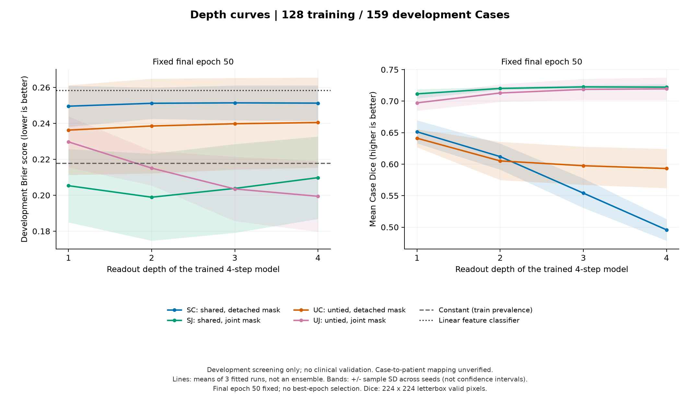
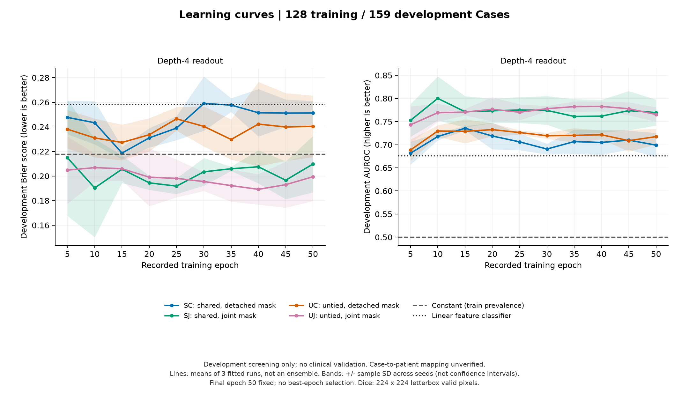

# 扩大 CPU 实验：128 个训练病例、三个随机种子

执行日期：2026-10-04。本轮从 8 个训练 Case、16 个开发 Case 的工程检查，扩大到固定的 128 个训练 Case、全部 159 个开发 Case。四组模型各运行三个训练随机种子，全部使用 CPU。

**已完成 12 次 CPU 训练，共 38,400 次参数更新。建议暂缓为原先“多次共享循环改善诊断”的假设投入大规模 GPU 训练，先做一个更有针对性的 CPU 对照。**

本轮有两个不同的观察：相对仅训练 mask 探针的 C 组，联合分割监督对应更好的良恶性预测表现；但共享联合模型继续从第二步算到第四步，三个随机种子的 Brier 都变差。非共享联合模型则呈相反方向。这让研究问题更具体了：**为什么联合监督有帮助，却没有转化为共享循环的额外深度收益？** 这是下一轮待验证的问题，尚未解释原因或确认研究创新性。

## 实验实际比较了什么

模型先用冻结的 ImageNet DeiT-Tiny 将完整超声图像编码成 196×192 的空间特征，再更新内部特征四次。每一步都读出良恶性概率和病灶 mask，所有四步都参与训练。这是编码器之后的循环模块实验，结论的范围限于这个实现。

| 组 | 更新特征的 Transformer block | mask 损失能否更新特征 | 可训练参数 |
|---|---|---|---:|
| SC | 同一个 block 用四次 | 不能；只训练 mask 探针 | 714,530 |
| SJ | 同一个 block 用四次 | 能；与分类一起训练 | 714,530 |
| UC | 四个独立 block，初始数值相同 | 不能；只训练 mask 探针 | 2,049,122 |
| UJ | 四个独立 block，初始数值相同 | 能；与分类一起训练 | 2,049,122 |

冻结编码器另有 5,717,416 个参数。共享模型的可训练参数约少 65%；这不是参数预算相同的架构比较，也不是与充分调优的普通 ViT 比较。

| 队列 | Case 数 | 图像数 | 良性 Case | 恶性 Case |
|---|---:|---:|---:|---:|
| 固定训练子集 | 128 | 227 | 87 | 41 |
| 全部 tune 开发集 | 159 | 281 | 108 | 51 |

选择种子为 20261004，独立于训练种子 17、29、43；十二次训练使用相同病例、视图、标签和编码器。每个 epoch 每个 Case 随机抽一张视图训练，评估时平均同一 Case 所有视图的概率。分割 Dice 先按图像计算，再按 Case 等权平均。

本轮固定 50 epoch、batch size 2、学习率 0.0003、AdamW、无增强；缓存冻结编码器特征。分类 BCE 与 mask 的 0.5×BCE + 0.5×soft Dice loss 相加，在四个深度上平均。每五个 epoch 记录一次开发指标，最后统一报告第 50 epoch。没有挑选最佳 epoch 或最佳随机种子。

两项基线只用训练集拟合：训练恶性比例的恒定概率 41/128，以及 StandardScaler + 固定 C=1 的 logistic regression。线性模型先平均空间特征，再平均全部视图特征；循环模型则平均各视图的预测概率，因此它是简单参考，不能视为视图聚合完全匹配的控制。

## 良恶性预测与分割

所有结果来自第 50 epoch、第 4 步读出。模型列为三个独立训练种子的均值±样本标准差；基线各拟合一次。

| 方法 | AUROC ↑ | Brier ↓ | NLL ↓ | Dice ↑ |
|---|---:|---:|---:|---:|
| 训练恶性比例常数 | 0.500 | 0.218 | 0.627 | — |
| 冻结特征 + 线性分类器 | 0.676 | 0.258 | 1.330 | — |
| SC | 0.699 ± 0.027 | 0.251 ± 0.010 | 2.038 ± 0.203 | 0.496 ± 0.017 |
| SJ | 0.770 ± 0.028 | 0.210 ± 0.023 | 1.770 ± 0.713 | 0.722 ± 0.005 |
| UC | 0.717 ± 0.017 | 0.240 ± 0.025 | 1.885 ± 0.322 | 0.593 ± 0.031 |
| UJ | 0.765 ± 0.015 | 0.199 ± 0.020 | 1.294 ± 0.163 | 0.720 ± 0.018 |

Brier 衡量概率的平方误差，NLL 会更重地惩罚错误且非常确定的预测，AUROC 衡量恶性病例能否排在良性病例前面。它们回答不同问题；Dice 高也不能替代诊断评估。

SJ 对常数基线的平均 Brier 差为 −0.0081，条件 Case bootstrap 区间为 [-0.0501, +0.0330]；UJ 为 −0.0185，区间为 [-0.0595, +0.0212]。两者区间都跨零；SJ 仅两个种子优于常数基线，UJ 三个种子都优于它。因此有方向上的信号，但不能称为可靠的泛化优势。

联合模型的平均 NLL 均差于常数基线，概率质量并未全面改善。NLL 使用 epsilon=1e−15 裁剪；float32 的概率饱和和裁剪策略会影响极端预测的 NLL 数值。它提示错误且过于确定的预测值得检查，但 Brier 或 NLL 本身不能证明失败的原因就是校准。

固定 0.5 阈值下，SJ 的敏感度为 0.575 ± 0.198、特异度为 0.812 ± 0.174；UJ 分别为 0.444 ± 0.030 和 0.904 ± 0.005。阈值没有校准，这些是开发集上的描述，不能据此判断临床可用性。

## 如何读逐轮结果

定义 D=Brier₂−Brier₄，正值表示继续到第四步后概率误差下降；S=Dice₄−Dice₂，正值表示分割更好。交互量 θD=(D_SJ−D_SC)−(D_UJ−D_UC)，检查联合分割监督与共享参数是否对应不同的深度收益。

这里的第二步与第四步是**同一个四步训练模型的中间与最终读出**，并不是各自重新优化的两步模型和四步模型。C 组的分割是脱离特征梯度的探针；其 Dice 变化也不能直接用来判断特征是否“忘记了病灶”。

| 组 | D：Brier₂−Brier₄ | 条件 Case 95% 区间 | D 为正的种子数 | S：Dice₄−Dice₂ |
|---|---:|---:|---:|---:|
| SC | -0.00009 | [-0.0041, +0.0036] | 2/3 | -0.11619 |
| SJ | -0.01088 | [-0.0265, +0.0036] | 0/3 | +0.00208 |
| UC | -0.00193 | [-0.0039, -0.0002] | 0/3 | -0.01203 |
| UJ | +0.01566 | [+0.0075, +0.0237] | 3/3 | +0.00662 |

SJ 的 D 在种子 17、29、43 下分别为 −0.01102、−0.01225、−0.00937，方向一致，但其条件区间仍跨零。SJ 的分割增加也很小，平均仅 +0.00208，其区间同样跨零。UJ 的 D 分别为 +0.01007、+0.02806、+0.00885。不能把这些中间读出的差异推广成所有循环模型的规律。

θD=-0.02838，条件 Case 区间为 [-0.0455, -0.0118]；三个种子分别为 −0.02297、−0.04116、−0.02100。它与原先期望的正向交互相反，是值得复核的观察，不是已找到机制的证据。

配对 bootstrap 将三个已拟合种子的效应先在每个 Case 内平均，再重采样 159 个 Case，执行 2,000 次。区间条件于这些已训练模型，不覆盖训练随机性的总体不确定性，也没有把同一个 Case 的三个预测当成三个患者。均值±标准差只描述三个种子的变动，不是置信区间，也不是模型集成的表现。

## 学习曲线与 CPU 资源

十二个模型的最终训练 AUROC 都为 1.0，而开发集明显较低，提示过拟合。SJ 的平均开发 Brier 在 epoch 10 为 0.1903，在固定最终 epoch 50 为 0.2098；这说明训练日程值得重新研究，但本轮仍保留原先规定的最终 epoch，不能拿事后挑出的最佳 epoch 替换主结果。

主 launcher 的实际经过时间为 **42.8 分钟**，包含本轮缓存检查、基线、训练和评估，不包含先前的数据下载、环境安装及报告整理。各次训练循环时间合计 50.9 分钟，每组 3,200 次更新；这不是纯更新时间。每个训练进程使用两个 PyTorch CPU 线程，中途用两个独立进程并行运行不同的种子，因此合计时间与经过时间不同，也不能用各组本次时间比较架构速度。

全部运行的配置、训练源代码哈希、冻结编码器哈希和病例集合均与锁定协议一致；train/tune 病例、视图与标签对齐通过。测试套件已通过 127 个测试及 41 个 subtest，依赖检查通过；图来自汇总 JSON，逐病例数据未公开。

## 这轮能回答的范围与下一步

本轮有病理良恶性标签，能够检验基准数据上的良恶性预测、概率质量和分割是否一起改善。它尚不能证明临床净获益：Case 与患者身份的对应尚未核实，原分辨率边界质量、外部验证、阈值校准和临床决策成本还没有评估。cal/test 未运行预测或用于选择结果；它们继续留作锁定后续方案后的评估。

建议按下面的顺序继续，CPU 足够承担前两项的初步验证：

1. **验证独立训练的两步与四步模型。** 同一批 Case、同一组种子，只改变训练深度；预先规定训练日程和模型选择规则，避免把四步模型的中间读出当成最优两步模型。核心问题是：反向深度收益在独立优化的两步、四步模型中是否仍然出现？若要单独识别中间监督的作用，还需加入“四步模型仅末步监督”的对照。
2. **控制过拟合与错误置信度。** 在新的锁定方案中比较明确的正则化或训练日程，检查共享/非共享模型逐步增加的信心是否对应真实纠错。选择实验方案的 tune 结果继续标为探索性；不要因为一个配置表现最好就认为机制成立。
3. **补齐研究与临床验证条件。** 核实患者分组，审查最接近的工作，明确预期临床决策、误诊成本与外部数据。校准/测试数据的使用要在后续方案锁定后进行。
4. **再决定 GPU 的用途。** 若稳定现象需要在线增强、解冻编码器、较高分辨率或更大队列来验证，GPU 才会明显方便。本轮没有表明计算量不足；单纯把当前设置放大不能解决已有的过拟合和对照问题。

这轮的价值是把一个宽泛的想法变成了可以证伪的问题：联合分割监督的作用与共享循环的深度作用能够分开测量，而且它们本次没有朝同一个方向变化。

## 复现与公开文件

协议见 [固定 CPU 配置](../configs/cpu_expanded128.json)，汇总数据见 [expanded128](../reports/expanded128/)。运行与分析命令见 [README](../README.md) 的 expanded CPU screen 部分。原始影像、病例 ID、逐图预测、特征缓存和 checkpoint 留在本地，不进入 public repo。
